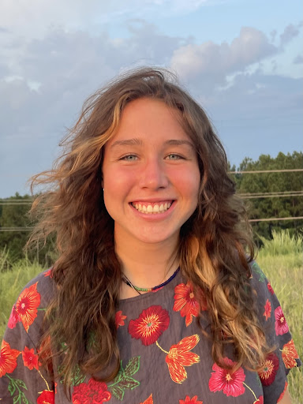

  
  

I’m a senior at Appalachian State University majoring in Public Health with minors in Mathematics and Statistics. My passions include biostatistics, data-driven public health research, and community involvement.

Explore my work here: 

  * [About Me](./about.qmd)
  
  * [Projects](.project.qmd)

  

{width=500}

<footer>
  
<strong>I'd love to hear from you!</strong>

  
Email me at getzeg@appstate.edu
  |
  Or connect on <a href="https://www.linkedin.com/in/emma-getz-7aa30821b" target="_blank">LinkedIn</a>

  
  
</footer>

